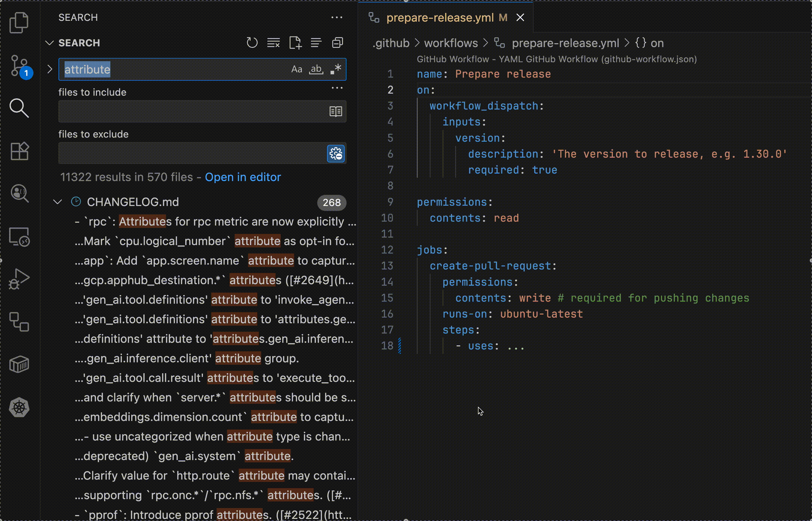

# Search by Code Owner

A VSCode extension that allows you to search for files by code owner with native VSCode search. The extension extracts code owners from CODEOWNERS file. According to your selected code owner, the extension will generate filters in native search panel for you for better search experience.

## License

MIT License - see `LICENSE` file for details
