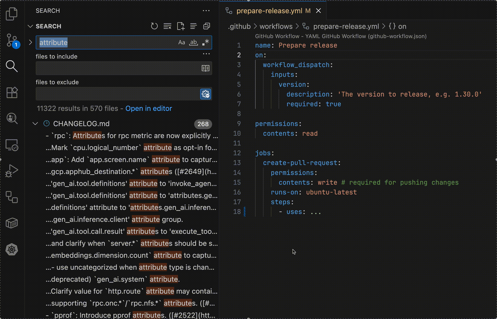

# Search by Code Owner

A VSCode extension that allows you to search for files by code owner with native VSCode search. The extension extracts code owners from CODEOWNERS file. According to your selected code owner, the extension will generate filters in native search panel for you for better search experience.

## Settings

- `codeOwner.experimental.multiRootWorkspace` (default: `false`): experimental support for `.code-workspace` files. When enabled and you opened a workspace file with two or more folders, or a single folder that points at a subdirectory (for example `./subFolder`), CODEOWNERS is resolved from the workspace file directory and search include/exclude patterns are rewritten to match VS Code Search roots (including renamed folders). A custom name on a single `.` folder is not rewritten.

## License

MIT License - see `LICENSE` file for details
