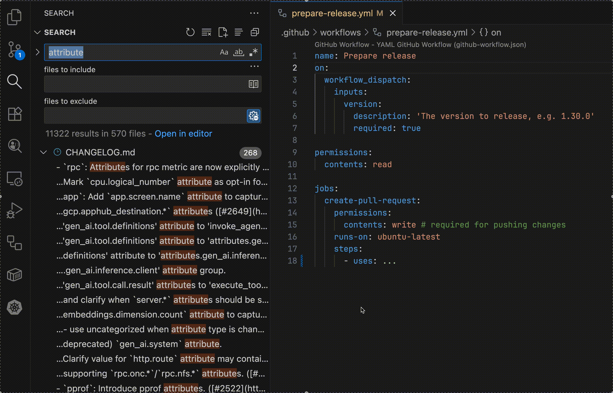

# Search by Code Owner

A VSCode extension that allows you to search for files by code owner with native VSCode search. The extension extracts code owners from CODEOWNERS file. According to your selected code owner, the extension will generate filters in native search panel for you for better search experience.



## AI agent tools

### VS Code Language Model tools [Experimental]

**This feature is experimental and may not work as expected. Use at your own risk.**

The extension contributes three VS Code Language Model tools for agents:

- List files assigned to a concrete CODEOWNER.
- Search file contents for a query within files assigned to a concrete CODEOWNER.
- Find matching CODEOWNERS names from a partial owner string, including values without the org prefix.

Content search supports case sensitivity, regular expressions, and whole-word matching. Both tools can optionally include `.gitignore` and VS Code-excluded files; both exclusions are enabled by default. `Unowned` and `Owned by all` are not supported by the agent tools.

### Cursor MCP server [Experimental]

**This feature is experimental and may not work as expected. Use at your own risk.**

Set `codeOwner.mcp.autoRegister` to `true` to turn auto-registration on.

The extension contributes a Cursor MCP server for agents for similar functionality as the VS Code Language Model tools.

Cursor may still ask you to enable or trust the server in MCP settings. You may need to set required permissions in project or global settings.

For example, you can set the following global settings in `~/.cursor/permissions.json`:

```jsonc
{
  "mcpAllowlist": [
    "other-mcp-servers:*",
    "search-by-code-owner:*", // Allowlist for the extension's MCP server
  ],
}
```

## Settings

- `codeOwner.mcp.autoRegister` (default: `false`): when the extension runs in Cursor, automatically register the bundled CODEOWNERS MCP server. Enable this to enable the MCP server
- `codeOwner.experimental.multiRootWorkspace` (default: `false`): experimental support for `.code-workspace` files. When enabled and you opened a workspace file with two or more folders, or a single folder that points at a subdirectory (for example `./subFolder`), CODEOWNERS is resolved from the workspace file directory and search include/exclude patterns are rewritten to match VS Code Search roots (including renamed folders). A custom name on a single `.` folder is not rewritten.

## License

MIT License - see `LICENSE` file for details
